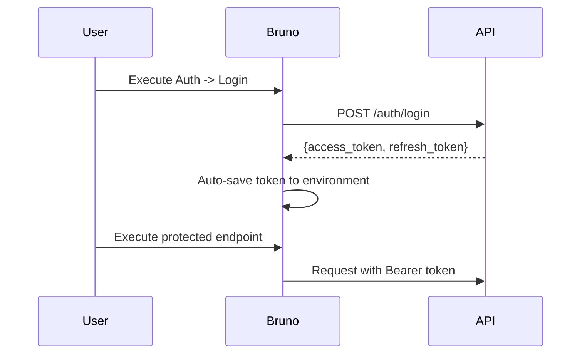

<div align="center">
  <h1>📚 Telaten API Documentation</h1>
  <p><strong>Interactive API Testing with Bruno Collection</strong></p>
  <p><em>Complete REST API documentation and testing suite for Telaten Backend</em></p>

  <!-- Badges -->
  <p>
    
    
    
    
  </p>
</div>

---

## 🌟 About This Collection

This repository contains the comprehensive API documentation for the **Telaten** project, managed using **Bruno** - a modern API testing tool that provides an excellent developer experience with offline capabilities.

## 📋 Prerequisites

Before using this API collection, ensure you have the required tools installed:

| **Tool** | **Purpose** | **Installation** |
|----------|-------------|------------------|
| **Bruno** | API testing and documentation | [Download from usebruno.com](https://www.usebruno.com/downloads) |
| **Git** | Version control (to clone this repo) | [Download Git](https://git-scm.com/downloads) |

### 🔧 Bruno Installation

| **OS** | **Installation Method** |
|--------|-------------------------|
| **Windows** | Download `.exe` from Bruno website |
| **macOS** | `brew install bruno` or download `.dmg` |
| **Linux** | Download `.AppImage` or use package manager |

---

## 🚀 Getting Started

### 1️⃣ Clone & Import Collection

**Step 1: Clone Repository**
```bash
git clone <repository-url>
cd telaten-docs-api
```

**Step 2: Import to Bruno**
1. Open **Bruno** application
2. Click **"Open Collection"** on the home screen
3. Navigate to the `telaten-docs-api` folder
4. Click **"Open"** to import the collection

### 2️⃣ Environment Configuration

> **🎯 Key Feature**: Multi-environment support for seamless development workflow

#### 🔧 Available Environments

| **Environment** | **Base URL** | **Usage** | **Purpose** |
|-----------------|--------------|-----------|-------------|
| **local** | `http://localhost:8000/api/v1` | Development | Local backend testing |
| **deploy** | `https://api.telaten.com/api/v1` | Production | Live API testing |
| **colab** | Custom URL | Testing | Special testing environments |

#### ⚙️ Switch Environment

1. In Bruno app, locate the environment dropdown (top-right corner)
2. Select your target environment from the dropdown
3. All requests will automatically use the selected base URL

### 3️⃣ Authentication Setup

> **🔐 Security**: Bearer Token Authentication with auto-token management

#### 🔑 Authentication Flow



#### 🛠️ Quick Authentication

1. **Login Request**: Navigate to `Auth > Login` endpoint
2. **Execute**: Send login request with valid credentials
3. **Auto-Save**: Token automatically saved to environment variables
4. **Protected Requests**: All subsequent requests use the saved token automatically

> **💡 Pro Tip**: The collection includes automated scripts that handle token management, so you don't need to manually copy/paste tokens!

---

---

## 📚 API Endpoints Reference

> **🎯 Complete**: All endpoints are organized by module with detailed descriptions

### 🔐 Authentication & Authorization

> **🎯 Purpose**: User registration, login, and session management

| **Method** | **Endpoint** | **Description** | **Authentication** |
|------------|--------------|-----------------|-------------------|
| `POST` | `/auth/register` | Register a new user account | ❌ Public |
| `POST` | `/auth/login` | Authenticate and obtain access tokens | ❌ Public |
| `POST` | `/auth/logout` | Invalidate current session | ✅ Required |
| `POST` | `/auth/refresh-token` | Refresh expired access token | 🍪 Refresh Cookie |
| `GET` | `/auth/me` | Get current user profile information | ✅ Required |

#### 🔑 Auth Features
- **🔒 Secure**: JWT tokens with bcrypt password hashing
- **🔄 Auto-refresh**: Automatic token renewal system
- **⏰ Session management**: Configurable token expiration

---

### 🏢 Business Profile Management

> **🎯 Purpose**: Business information and profile management

| **Method** | **Endpoint** | **Description** | **Authentication** |
|------------|--------------|-----------------|-------------------|
| `POST` | `/business/profile` | Create new business profile | ✅ Required |
| `GET` | `/business/profile` | Retrieve business profile details | ✅ Required |
| `PUT` | `/business/profile` | Update business information | ✅ Required |
| `GET` | `/business/levels` | Get all available business levels | ✅ Required |

#### 🏪 Business Features
- **📊 Gamification**: Points and level progression
- **🤖 AI Context**: Persistent memory for AI interactions
- **📍 Location**: Structured address information

---

### 🤖 AI Chat Assistant

> **🎯 Purpose**: Interactive AI-powered business advisory

| **Method** | **Endpoint** | **Description** | **Features** |
|------------|--------------|-----------------|--------------|
| `POST` | `/chat/completion` | Send message and receive AI response | 📡 SSE Streaming |
| `GET` | `/chat/sessions` | List all chat sessions | 📚 History |
| `GET` | `/chat/history` | Get messages from specific session | 💬 Context |
| `DELETE` | `/chat/session/:id` | Remove chat session | 🗑️ Cleanup |

#### 🧠 AI Features
- **🎯 Context-aware**: Business profile integration
- **⚡ Real-time**: Server-Sent Events for live responses
- **🛠️ Tool-enabled**: Access to business functions
- **🌐 Multi-language**: Indonesian/English support

---

### 🎯 Milestone & Task Management

> **🎯 Purpose**: Business goal tracking and task completion

| **Method** | **Endpoint** | **Description** | **Auto-Actions** |
|------------|--------------|-----------------|------------------|
| `GET` | `/milestones` | List business milestones | 📊 Status filtering |
| `POST` | `/milestones` | Create new milestone | 🎮 Points award |
| `GET` | `/milestones/:id` | Get detailed milestone info | 📋 Tasks included |
| `PUT` | `/milestones/:id` | Update milestone details | 🔄 Progress tracking |
| `POST` | `/milestones/:id/start` | Begin milestone work | 📈 Status change |
| `POST` | `/milestones/task/complete` | Mark task as completed | 🏆 Auto-completion |

#### ⭐ Milestone Features
- **🤖 AI-Generated**: Personalized business goals
- **🔄 Adaptive**: Dynamic difficulty progression
- **🎮 Gamified**: Points and achievement rewards
- **📊 Progress tracking**: Real-time completion status

---

### 💰 Financial Tracking

> **🎯 Purpose**: Income/expense management and analytics

| **Method** | **Endpoint** | **Description** | **Features** |
|------------|--------------|-----------------|--------------|
| `GET` | `/finance/transactions` | List financial transactions | 🔍 Filtering & pagination |
| `POST` | `/finance/transactions` | Record new transaction | 🎮 +5 points reward |
| `DELETE` | `/finance/transactions/:id` | Remove transaction | 📊 Updates summaries |
| `GET` | `/finance/summary` | Get financial analytics | 📈 Period-based reports |
| `GET` | `/finance/categories` | List transaction categories | 🏷️ System + custom |
| `POST` | `/finance/categories` | Create custom category | 🎨 Business-specific |

---

### 🏆 Gamification System

#### 👤 User Endpoints

| **Method** | **Endpoint** | **Description** | **Features** |
|------------|--------------|-----------------|--------------|
| `GET` | `/gamification/achievements` | Available achievements | 🏅 All unlockable badges |
| `GET` | `/gamification/my-achievements` | User's earned achievements | ⭐ Personal collection |
| `GET` | `/gamification/leaderboard` | Top-ranked businesses | 🏆 Competition rankings |
| `GET` | `/gamification/summary` | Current points and level | 📊 Progress overview |

#### 🔧 Admin Endpoints

| **Method** | **Endpoint** | **Description** | **Access Level** |
|------------|--------------|-----------------|------------------|
| `POST` | `/gamification/achievements` | Create new achievement | 👑 Admin only |
| `PUT` | `/gamification/achievements/:id` | Update achievement | 👑 Admin only |
| `DELETE` | `/gamification/achievements/:id` | Remove achievement | 👑 Admin only |
| `POST` | `/admin/levels` | Create business level | 👑 Admin only |

#### 🎮 Gamification Features
- **📈 Progressive levels**: Bronze → Silver → Gold → Platinum
- **🏅 Achievement system**: Unlockable badges for milestones
- **🏆 Leaderboards**: Competitive rankings by points
- **🎯 Point rewards**: Consistent activity incentives

---

## 💡 Pro Tips & Best Practices

### 🚀 **Workflow Optimization**

| **Tip** | **Description** | **Benefit** |
|---------|-----------------|-------------|
| **🔄 Use Environment Switching** | Switch between `local` and `deploy` environments easily | Test across different stages seamlessly |
| **📚 Explore Collections** | Browse organized folders for different modules | Find endpoints quickly by feature |
| **🔐 Stay Authenticated** | Login once per session, auto-token handles the rest | No manual token management needed |
| **📊 Check Responses** | Review response examples and status codes | Understand expected API behavior |

### 🛠️ **Development Workflow**

```
1. 🏗️  Start Backend Server (see telaten-backend README)
2. 🚀  Open Bruno & Import Collection  
3. 🌍  Select 'local' Environment
4. 🔑  Execute Auth → Login
5. ✅  Test Any Endpoint (auto-authenticated)
```

### 📋 **Common Testing Scenarios**

#### 🆕 **New User Journey**
1. `POST /auth/register` - Create account
2. `POST /auth/login` - Get tokens
3. `POST /business/profile` - Setup business
4. `GET /business/levels` - Check available levels

#### 🎯 **Business Operations**
1. `GET /milestones` - View current goals
2. `POST /milestones/:id/start` - Begin working
3. `POST /milestones/task/complete` - Mark progress
4. `GET /gamification/summary` - Check points

#### 💰 **Financial Tracking**
1. `GET /finance/categories` - Available categories
2. `POST /finance/transactions` - Record transaction
3. `GET /finance/summary` - View analytics
4. `GET /gamification/achievements` - Check rewards

---

## 🔧 Collection Features

### ✨ **Built-in Automation**

| **Feature** | **Functionality** | **User Benefit** |
|-------------|-------------------|------------------|
| **🔑 Auto-Authentication** | Saves tokens from login response | No manual token copying |
| **🌐 Environment Variables** | Dynamic base URL switching | Easy testing across environments |
| **📊 Response Validation** | Built-in status code checks | Automatic error detection |
| **📝 Request Examples** | Pre-filled request bodies | Quick testing without setup |

### 📚 **Documentation Integration**

- **📖 In-app Docs**: Each request includes detailed descriptions
- **📋 Example Requests**: Pre-configured with realistic data
- **✅ Expected Responses**: Sample responses for successful requests
- **❌ Error Scenarios**: Common error cases and troubleshooting

---

## 🤝 Contributing to API Docs

### 📝 **When to Update**

| **Scenario** | **Action Required** |
|--------------|-------------------|
| **New Endpoint** | Add new request to appropriate folder |
| **Changed Response** | Update response examples |
| **New Environment** | Add environment configuration |
| **Authentication Changes** | Update auth scripts |

### 🔄 **Update Process**

1. **Test Changes**: Verify new endpoints work locally
2. **Update Collection**: Add/modify requests in Bruno
3. **Document**: Update README if needed
4. **Validate**: Test across all environments

---

## 📞 Support & Resources

### 🆘 **Getting Help**

| **Issue Type** | **Resource** | **Action** |
|----------------|--------------|------------|
| **Bruno Setup** | [Bruno Documentation](https://docs.usebruno.com/) | Check official guides |
| **API Issues** | Backend Documentation | See `telaten-backend/docs/` |
| **Collection Problems** | GitHub Issues | Report bugs or request features |
| **General Questions** | Team Communication | Contact development team |

### 🔗 **Related Resources**

- **🔧 Backend Repo**: Complete backend documentation and setup
- **🎨 Frontend Repo**: Client application integration examples  
- **📚 Architecture Docs**: System design and workflow explanations
- **🏗️ Deployment Guides**: Production setup and configuration

---

<div align="center">
  <h3>🎯 Ready to Explore the Telaten API!</h3>
  <p><strong>Interactive • Comprehensive • Developer-Friendly</strong></p>
  
  <!-- Quick Action Buttons -->
  <p>
    
    
    
  </p>

  <p><em>Built with ❤️ using Bruno for the Telaten ecosystem</em></p>
</div>
